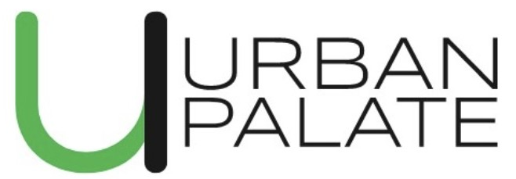

# Urban Palate - Food Ordering Website Prototype

 <!-- Optional: Replace with a link to a screenshot -->

## Description

Urban Palate is an interactive front-end prototype simulating a modern online food ordering website. It allows users to sign up, log in using various methods, browse a menu fetched from a cloud database, manage a shopping cart, and place simulated orders. This project demonstrates the integration of front-end web technologies (HTML, CSS, JavaScript) with backend services provided by Firebase (Authentication and Firestore Database).

## Features

*   **User Authentication:**
    *   Sign up with Email/Password.
    *   Login with Email/Password.
    *   Sign in with Google (Popup).
    *   Sign in with Phone Number (SMS verification via reCAPTCHA).
    *   Secure session management via Firebase Auth state persistence.
    *   Logout functionality.
*   **Menu Display:**
    *   Dynamically fetches menu items (name, description, price, image) from Firestore.
    *   Displays items in an attractive card layout.
*   **Shopping Cart:**
    *   Add items to the cart from the menu.
    *   View items currently in the cart.
    *   Increase/decrease item quantity within the cart.
    *   Remove items from the cart.
    *   Real-time calculation of the total price.
    *   Cart persists across sessions using browser `localStorage`.
*   **Checkout &Okay, here is Order Placement:**
    *   Simulated checkout process requiring delivery information.
 a template for a good `README.md` file for your "Urban Palate" project on GitHub. Copy and paste this into a new file named `README    *   Order details (user ID, cart items, total, delivery info, timestamp) are saved securely to the Firestore database.
*   **User Interface:**
    .md` in the root of your project folder (`UrbanPalate_Complete*   Responsive design adapting to different screen sizes (desktop, tablet, mobile).
    *`), then push it to GitHub.

**Remember to:**

*   Replace placeholders like `[Your Name/Username]` and potentially add a live demo link if you deployed   Modern aesthetic using CSS variables, Flexbox/Grid, and subtle transitions.
    * it.
*   Add screenshots if you have them.
*   Customize   User feedback via toast notifications for actions like adding/removing items and placing orders.
 the features list and acknowledgements as needed.

```markdown
# Urban Palate -*   **Accessibility:**
    *   Includes basic accessibility features like skip links, AR Food Ordering Website Prototype

 <!-- OptionalIA attributes (`aria-label`, `aria-current`, `role`, `: Make sure logo.png is in the root -->

**Urban Palate** isaria-live`), semantic HTML, and focus management (`:focus-visible`).

 a front-end web application prototype simulating a modern online food ordering experience. It allows## Technologies Used

*   **Frontend:**
    *   HTML5
    *    users to sign up, log in, browse a menu fetched from a database,CSS3 (including Flexbox, Grid, CSS Variables)
    *   Vanilla manage a shopping cart, and place simulated orders. The project utilizes Firebase for backend services like JavaScript (ES6+)
*   **Backend Services (Firebase):**
 authentication and database storage.

<!-- Optional: Add a screenshot of the main page -->
<!--    *   **Firebase Authentication:** For handling Email/Password, Google, and Phone  -->

<!-- Optional: Add Live Demo Link if deployed -->
<!-- ** menu items and user orders.
*   **Fonts:** Google Fonts (Poppins, MerLive Demo:** [https://your-username.github.io/your-reporiweather)
*   **Icons:** Font Awesome

## Project Structure
